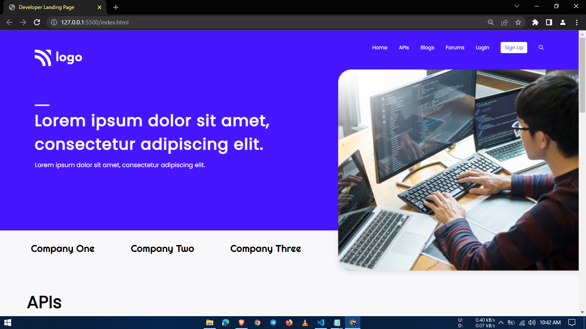

# 9-Developer-landing-page
It is part of the Full Stack Javascript Bootcamp being taught at ineuron.ai by Hitesh Choudhary Sir.

## Project 9 [Live Link](https://developer-landing-pages.netlify.app/)

-   During this project, I gained the following skills:
    -   I learned how to use various Flexbox properties.
    -   I learned about attribute selectors
---

## Time taken to finish this project

-   2 hour to complete it.

#### Screenshot

